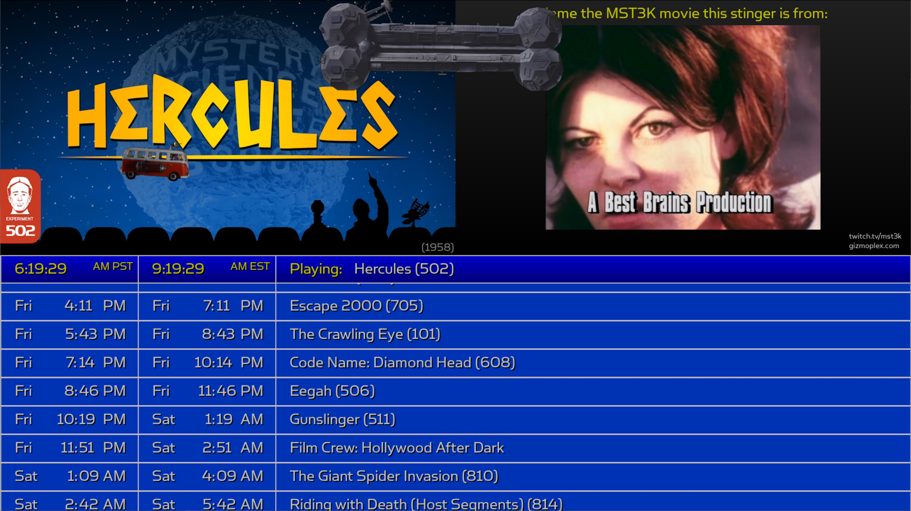

# ScheduleScroller
Find the ScheduleScroller in action at [twitch.tv/MovieVox](https://www.twitch.tv/movievox)

### About
ScheduleScroller creates a scrolling schedule of upcoming movies
for the MST3K Twitch channel, [twitch.tv/mst3k](https://www.twitch.tv/mst3k).

The times are listed in Pacific and Eastern time zones to cover the most viewers possible.
Also, a graphic of the currently playing movie is shown along with a brief summary of the movie.

There is also a chatbot that will display trivia in the chat
and on-screen. Some trivia asks the users to identify a character or scene from a movie and
that image is displayed on screen instead of the summary. Once the trivia is over, the summary
returns.

For fun, every so often a special animation will pop up.

In the screenshot above, notice the currently playing movie graphic in the 
upper left, a trivia question about a stinger in the upper right, the satellite and van
flying across the screen (a little bit of fun to add some visual interest), and the 
scrolling schedule on the bottom half of the screen.

### Dependencies
* **twitchio** (2.10.0)
* **pygame** (v2.6.1, used to render all the graphics)
* **pytz** (for time zone conversion)
* **aiohttp** (for asynchronous methods)
* **requests** (for request/response of Twitch API tokens)

_All image copyrights belong to their respective owners._
